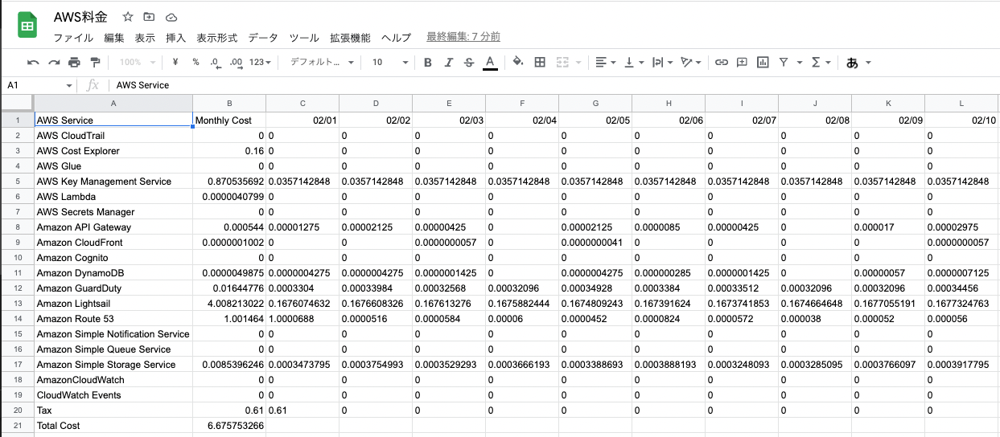
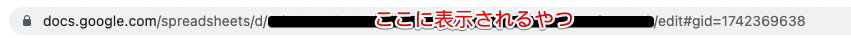

# aws-usage-to-gsheets



-   AWS の料金を Google スプレッドシートに書き込むための Lambda 関数
-   1 列目　　：AWS サービス名
-   2 列目　　：当月の前日までの使用料金のサービス別合算
-   3 列目以降：当月の前日までの日付別の料金
-   シートは名称「YYYYMM」で自動作成
-   ※実行すると Lambda と CostExplorer の実行料金がわずかに発生

<br/>
<br/>

## 前提条件

-   使用する PC に Node.js がインストールされていること
-   GCP で Google Sheets API と Google Drive API が有効化されていること
-   GCP で Google スプレッドシートにアクセスするためのサービスアカウントが作成されていること
-   書き込むための Google スプレッドシートが作成されていて、共有設定に上記のサービスアカウントが追加されていること

<br/>
<br/>

## 使用方法

1. このソースをダウンロード・パッケージインストール
    ```
    git clone https://github.com/tukky-14/aws-usage-to-gsheets.git
    npm i
    ```
1. Lambda 関数を作成
    - ランタイム：Node.js 16.x
    - アーキテクチャ：x86_64
    - 一般設定
        - メモリ：1024MB
        - エフェラルストレージ：512MB（デフォルト）
        - タイムアウト：10 秒
    - アクセス権限
        - CostExplorer への ReadOnly アクセス権限の IAM ポリシー（例）
            ```
            {
                "Version": "2012-10-17",
                "Statement": [
                    {
                        "Sid": "VisualEditor0",
                        "Effect": "Allow",
                        "Action": "ce:GetCostAndUsage",
                        "Resource": "*"
                    }
                ]
            }
            ```
        - CloudWatch へのアクセス権限の IAM ポリシー（例）
            ```
            {
                "Version": "2012-10-17",
                "Statement": [
                    {
                        "Effect": "Allow",
                        "Action": "logs:CreateLogGroup",
                        "Resource": "arn:aws:logs:ap-northeast-1:<AWSアカウント番号>:*"
                    },
                    {
                        "Effect": "Allow",
                        "Action": [
                            "logs:CreateLogStream",
                            "logs:PutLogEvents"
                        ],
                        "Resource": [
                            "*"
                        ]
                    }
                ]
            }
            ```
    - 環境変数（事前に作成した GCP のサービスアカウントの鍵情報）
        - GOOGLE_SHEET_ID
            - Google スプレッドシートの URL に表示される不規則な文字列
              <!--  -->
              
        - GOOGLE_SHEET_CLIENT_EMAIL
            - GCP のサービスアカウントの鍵情報
        - GOOGLE_SHEET_PRIVATE_KEY
            - GCP のサービスアカウントの鍵情報
1. Lambda 関数をアップロード
    - 任意の方法で Lambda 関数をアップロード
    - マネジメントコンソールからの場合は.zip ファイル
1. 実行
    - Amazon EventBridge で定期実行するといいかも
